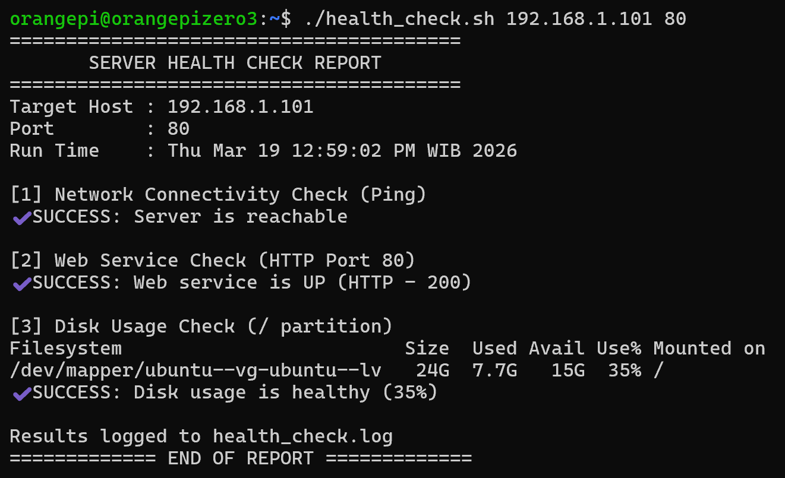
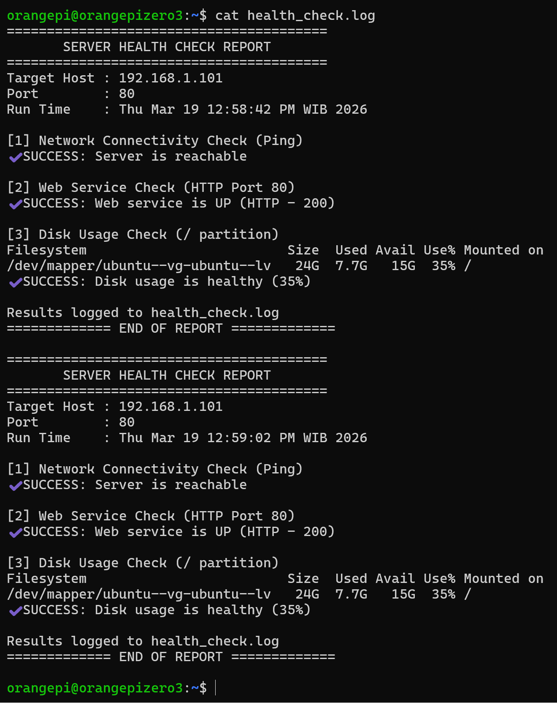

# Challange 1 Instruction

## Brief Summary
This script performs a basic server health check including:

- Network connectivity (Ping)
- Web service availability (HTTP)
- Disk usage via SSH

All results are logged into a file for monitoring and troubleshooting.

### Health Check Script


### Health Check Log Output


## Requirements
### 1. Local Machine
- Bash shell
- ping (Notes: ping used in Linux. Windows based command may different)
- curl
- ssh

### 2. Remote Server
- SSH access enabled
- df command available (standard Linux)

### 3. SSH Setup (Important)
- SSH key-based authentication must be configured:
    ```bash
    ~/.ssh/health_check_key
    ```
- Ensure:
    ```bash
    chmod 600 ~/.ssh/health_check_key
    ```
- Public key must exist in:
    ```bash
    ~/.ssh/authorized_keys (on target server)
    ```
- Recommended: Restrict SSH Key (Security Best Practice)
<br>Instead of allowing full SSH access, restrict the key to only run disk check command.
Example content of authorized_keys:
    ```bash
    command="df -h /",no-port-forwarding,no-X11-forwarding,no-agent-forwarding,no-pty ssh-rsa XXXX
    ```
## Configuration
Edit the following variables inside the script if needed:
```bash
HOST="192.168.1.101"                   # Target server IP / hostname
PORT="80"                              # Web service port
SSH_USER="health_check"                # SSH user for remote access
SSH_KEY="$HOME/.ssh/health_check_key"  # Path to private SSH key
PING_TIMEOUT=2                         # Ping timeout (seconds)
DISK_THRESHOLD=80                      # Disk usage alert threshold (%)
LOG_FILE="health_check.log"            # Log file output
```

## How to Run

### 1. Make Script Executable
```bash
chmod +x health_check.sh
```

### 2. Run Without Arguments (Default Values)
```bash
./health_check.sh
```

### 3. Run With Arguments (Recommended)
```bash
./health_check.sh <HOST> <PORT>
```
- Example:
    ```bash
    ./health_check.sh 192.168.1.200 8080
    ```

## Action Taken Reasoning
This section explains the design decisions behind each check in the script, focusing on reliability, accuracy, and security.

### 1. Ping Check Design
```bash
ping -c 2 -W $PING_TIMEOUT $HOST
```

#### Why this approach? 
- -c 2 (2 packets only)
<br>Limits the number of ping requests to avoid unnecessary delay.
Enough to confirm basic network reachability without slowing down the script.

- -W $PING_TIMEOUT (timeout control)
<br>Prevents the script from hanging too long if the host is down.
Ensures fast failure detection (important for automation / monitoring).

### 2. HTTP Check with curl
```bash
curl -s -o /dev/null -w "%{http_code}" --connect-timeout 3 http://$HOST:$PORT
```

#### Why this approach?
- -s (silent mode) → no unnecessary output
- -o /dev/null → discard response body (faster & cleaner)
- -w "%{http_code}" → extract only HTTP status code
- --connect-timeout 3 → avoid long wait if service is down

#### Why not just check "200"?
Because:
- 301/302 (redirect) still means service is alive
- 403/401 means app is running but restricted
- This gives better observability, not just binary UP/DOWN

### 3. Disk Check via SSH
```bash
ssh -i "$SSH_KEY" ... "$SSH_USER@$HOST" "df -h /"
```

Why use SSH?

Because checking disk usage via script:
- Cannot be checked externally via HTTP (It can but may need to create simple API)
- Requires remote command execution

SSH provides:
- Secure communication (encrypted)
- Controlled access

