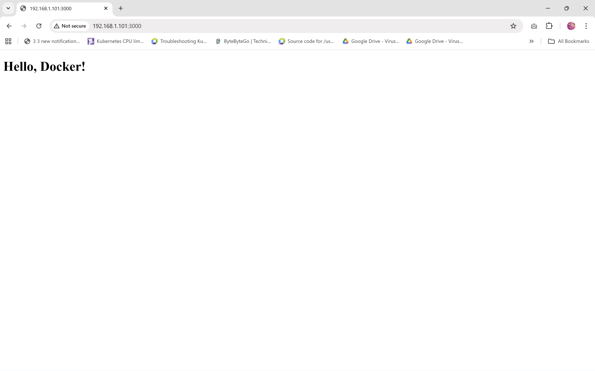
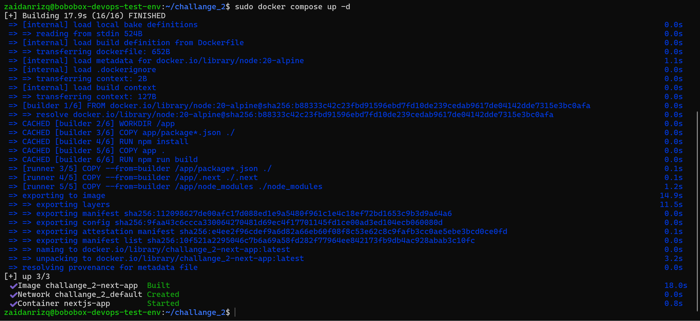

# Challange 2 Instruction

## Brief Summary
This project demonstrates how to containerize a simple Next.js application using Docker with a multi-stage build approach. The goal is to produce a lightweight, production-ready image while maintaining efficient build performance.

### Web App Running:


### Build Process:


## Requirements
Make sure the following are installed:
- Docker
- Docker Compose

## Challange 2 Folder Structure
```bash
.
├── app/
│   ├── package.json
│   └── pages/
│       └── index.js
├── Dockerfile
├── docker-compose.yml
└── README.md
```

## How to Run
1. Build the Docker Image
    ```bash
    docker-compose build
    ```
2. Run the Application
    ```bash
    docker-compose up -d
    ```
3. Access the Application on http://[HOST.IP]:3000
<br>Change HOST.IP with the ip of your host running the Container


4. Stop the Application
    ```bash
    docker-compose down
    ```

## Action Taken Reasoning

### 1. Use of Multi-Stage Build

The Dockerfile uses a multi-stage build:

- Builder Stage

    - Installs dependencies

    - Builds the Next.js application

- Runner Stage

    - Contains only the built app and required dependencies

Why?

- Reduces final image size

- No unnecessary build tools

### 2. Using node:alpine Image

A lightweight Node.js base image is used.

Why?

- Smaller image size

- Faster pull and startup time

### 3. Layer Caching Optimization
```docker
COPY package*.json ./
RUN npm install
```
Why?

- Dependencies are cached unless package.json changes

- Speeds up rebuild process

### 4. Docker Compose Usage

Docker Compose restart policy is used for reliability.
```docker
ports:
  - "3000:3000"
restart: always
```