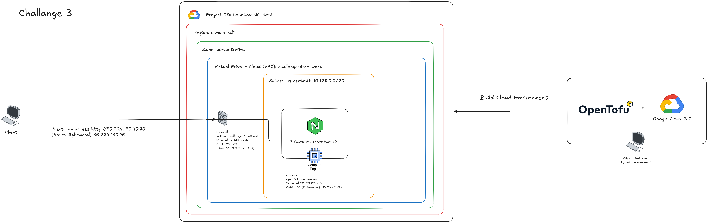
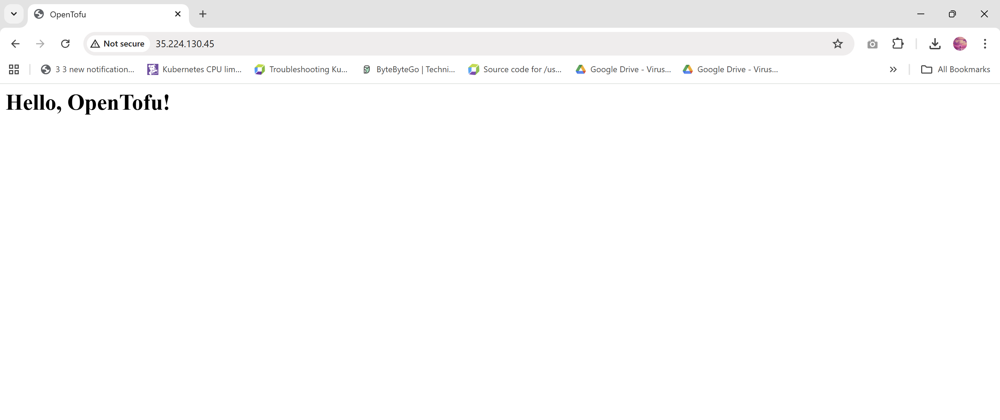
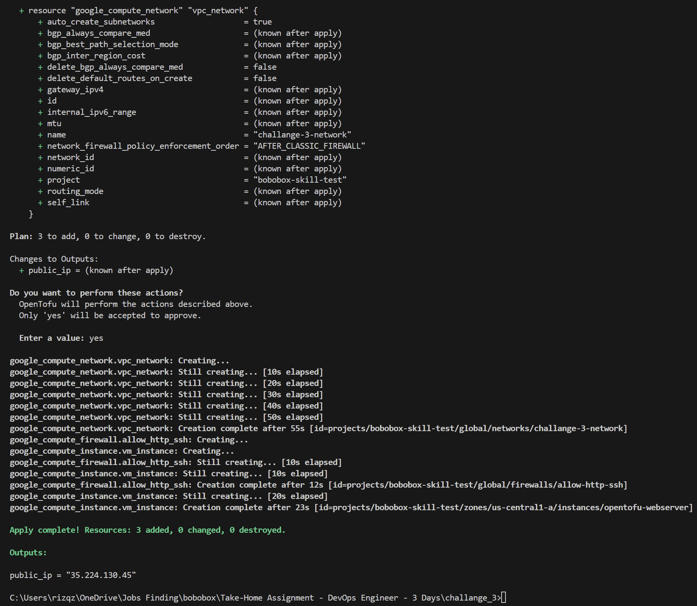
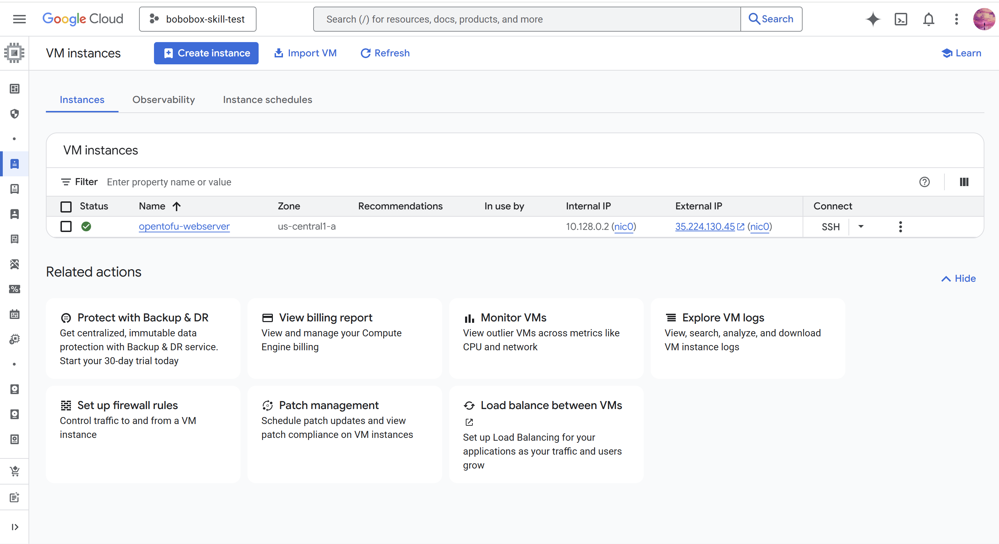

# Challange 3 Instruction

## Brief Summary
This challange demonstrates how to use OpenTofu (Infrastructure as Code) to provision a simple web server on Google Cloud Platform (GCP).

The infrastructure automatically:

- Creates a Virtual Machine (VM)

- Configures firewall rules (SSH & HTTP)

- Installs Nginx using a startup script

- Serves a simple "Hello, OpenTofu!" webpage

- Outputs the public IP for access

### Topology:

Notes: Firewall rules updated ssh not allowed
### Web Server:

### Tofu Init Plan Apply:

### Google Cloud Environment:


## Prerequisites

Before running this project, ensure you have:

### 1. OpenTofu Installed

    Verify installation:
    ```bash
    tofu version
    ```
### 2. Google Cloud CLI Installed

    Install and verify:
    ```bash
    gcloud version
    ```
### 3. GCP Authentication (IMPORTANT)
<br>Login and configure application credentials:
    ```bash
    gcloud auth application-default login
    ```

### 4. GCP Project Setup
    - Create a project via GCP Console (Web UI)
    - Copy the Project ID

### 5. Configure Variables

Fill below variable on terraform.tfvars

Example:
```
project_id    = "your-project-id"
region        = "us-central1"
zone          = "us-central1-a"
machine_type  = "e2-micro"
instance_name = "opentofu-webserver"
```

## Steps to Run
### 1. Initialize OpenTofu
```bash
tofu init
```
### 2. Validate Configuration (Optional)
```bash
tofu validate
```
### 3. Preview Infrastructure Plan
```bash
tofu plan
```
### 4. Apply Configuration
```bash
tofu apply
```
Type yes when prompted.

### 5. Access the Web Server

After deployment, OpenTofu will output:
```bash
public_ip = "X.X.X.X"
```
Open in browser:
```
http://<public_ip>
```
Expected output:
Hello, OpenTofu!

## Destroy Resources (Cleanup)
To avoid unnecessary charges:
```bash
tofu destroy
```
Type yes when prompted.

## Action Taken & Reasoning

### 1. Use of Variables

Variables (variables.tf + terraform.tfvars) were implemented to:

- Improve reusability

- Avoid hardcoding values

- Allow easy environment changes

### 3. VM Provisioning

A lightweight VM (e2-micro) was selected because:

- It is eligible for GCP Free Tier

- Sufficient for a simple web server

### 4. Firewall Configuration

Firewall rules were created to allow:

- Port 22 → SSH access

- Port 80 → HTTP traffic

This ensures the server is both accessible and manageable.

### 5. Startup Script Automation

A startup.sh script is used to:

- Install Nginx automatically

- Start and enable the service

- Deploy a custom HTML page

Reason:

- Eliminates manual configuration

- Ensures consistent server setup

6. Public IP Output

The public IP is defined as an output to:

- Easily retrieve access information

- Improve usability after deployment

7. Ephemeral Public IP

An ephemeral IP is used instead of static:

- Simpler setup

- No additional cost

- Suitable for testing/demo purposes